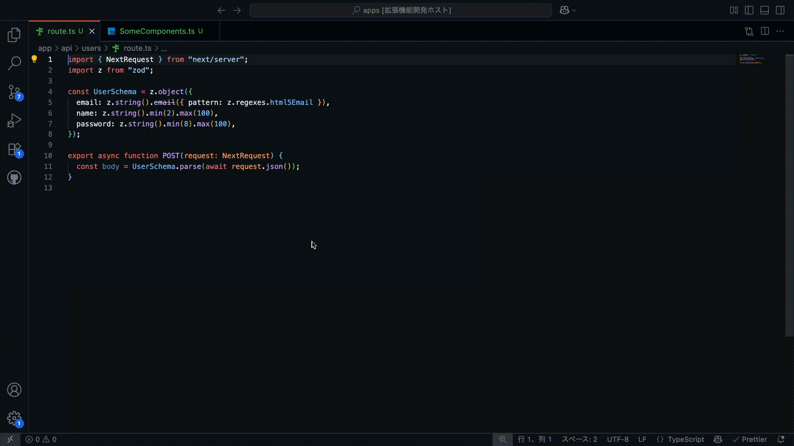

# TypeView

**Show TypeScript API request body types on hover for TypeScript + Monorepo projects**


[日本語版 README](./README_ja.md) | [English README](./README.md)

## 🚀 Features

- **Hover Type Display**: Hover over `fetch("/api/...")` calls to see TypeScript request body types
- **Next.js App Router Support**: Works seamlessly with Next.js App Router API routes
- **TypeScript Path Alias Resolution**: Supports `@/` and other path aliases defined in tsconfig.json
- **Multiple Type Definition Patterns**: Automatically detects imported types, local type definitions, and Zod schemas
- **Flexible Type Extraction**: Advanced AST analysis supporting various code patterns



## 📦 Installation

1. Open VS Code
2. Go to Extensions (Ctrl+Shift+X / Cmd+Shift+X)
3. Search for "TypeView"
4. Click Install

Or install directly from the [VS Code Marketplace](https://marketplace.visualstudio.com/items?itemName=Ayumu3746221.typeview).

## ⚙️ Configuration

Add these settings to your workspace `.vscode/settings.json`:

```json
{
  "typeview.framework": "nextjs-app-router",
  "typeview.routeDirectories": ["app/api"]
}
```

### Settings

| Setting                     | Description                                        | Default               |
| --------------------------- | -------------------------------------------------- | --------------------- |
| `typeview.framework`        | Backend framework type                             | `"nextjs-app-router"` |
| `typeview.routeDirectories` | API route directories (relative to workspace root) | `[]`                  |

## 🎯 Usage

1. Configure your workspace settings (see above)
2. Open a TypeScript/TSX file
3. Write code like: `fetch("/api/users")`
4. Hover over the API path to see the request body type definition

## 💡 Supported Patterns

TypeView automatically detects various code patterns:

### 1. Type Annotation Pattern

```typescript
import { UserCreateInput } from "@/types/user";

export async function POST(req: Request) {
  const body: UserCreateInput = await req.json(); // Detects imported types
  return Response.json({ success: true });
}
```

### 2. Type Assertion Pattern

```typescript
export async function POST(req: Request) {
  const body = (await req.json()) as UserCreateInput; // Detects type assertions
  return Response.json({ success: true });
}
```

### 3. Local Type Definition Pattern

```typescript
// Type defined in the same file
interface CreatePostRequest {
  title: string;
  content: string;
  tags?: string[];
}

export async function POST(req: Request) {
  const body: CreatePostRequest = await req.json(); // Detects local types
  return Response.json({ success: true });
}
```

### 4. Zod Schema Pattern

```typescript
import { z } from "zod";

const UserSchema = z.object({
  name: z.string(),
  email: z.string().email(),
  age: z.number().optional(),
});

export async function POST(req: Request) {
  const body = UserSchema.parse(await req.json()); // Detects Zod schemas
  return Response.json({ success: true });
}
```

### Hover Display Examples

When calling APIs in your components:

```typescript
// In your component
const handleSubmit = async (userData: any) => {
  const response = await fetch("/api/users", {
    // <- Hover here!
    method: "POST",
    body: JSON.stringify(userData),
  });
};
```

When you hover over `"/api/users"`, you'll see the corresponding API route's type information:

```typescript
// For imported types
interface UserCreateInput {
  name: string;
  email: string;
  age?: number;
}
*From: `@/types/user`*

// For local definitions
interface CreatePostRequest {
  title: string;
  content: string;
  tags?: string[];
}
*(Defined in same file)*

// For Zod schemas
const UserSchema = z.object({
  name: z.string(),
  email: z.string().email(),
  age: z.number().optional()
});
*From: `zod`*
```

## 📁 Project Structure

TypeView supports various project structures:

### Pattern 1: Using Imported Types

```
your-project/
├── app/
│   └── api/
│       └── users/
│           └── route.ts        # API route file
├── lib/
│   └── types/
│       └── user.ts             # Type definitions
└── .vscode/
    └── settings.json           # TypeView configuration
```

### Pattern 2: Using Local Type Definitions

```
your-project/
├── app/
│   └── api/
│       └── posts/
│           └── route.ts        # API route + type definitions
└── .vscode/
    └── settings.json           # TypeView configuration
```

### Pattern 3: Using Zod Schemas

```
your-project/
├── app/
│   └── api/
│       └── validate/
│           └── route.ts        # API route + Zod schemas
└── .vscode/
    └── settings.json           # TypeView configuration
```

## ✨ v0.2.0 New Features

- **🔍 Advanced Pattern Matching**: Automatically detects multiple code patterns
- **📍 Local Type Definition Support**: Detects and displays types defined in the same file
- **⚡ Zod Schema Support**: Supports modern type validation libraries
- **🏗️ Architecture Improvements**: Extensible design using Strategy pattern
- **🧪 Comprehensive Testing**: Quality assurance with 34 automated tests

## 🚧 Limitations

### Current Limitations

- Only Next.js App Router is supported
- Limited to `.ts` and `.tsx` file extensions
- Only POST functions are supported (GET, PUT, DELETE support coming soon)

### Planned Features

- Zero Configuration support
- Support for all HTTP methods (GET, PUT, DELETE, etc.)
- Support for HTTP request libraries other than fetch (e.g., Axios)
- Support for other frameworks like Hono
- Better error handling and diagnostics
- Performance optimizations

## 🤝 Contributing

We welcome contributions! Please check out our [GitHub repository](https://github.com/Ayumu3746221/TypeView) for:

- 🐛 Bug reports
- 💡 Feature requests
- 🔧 Pull requests
- 📖 Documentation improvements

### 🌍 English Documentation Help Needed

**Note**: The primary author is a Japanese developer. We are actively seeking contributors to help improve the English documentation, fix grammatical errors, and make the content more accessible to international users. If you're a native English speaker or have strong English skills, your help would be greatly appreciated!

## 📝 License

MIT License - see [LICENSE](./LICENSE) for details.

## 🙋‍♂️ Support

- 🐛 [Report Issues](https://github.com/Ayumu3746221/TypeView/issues)
- 💬 [Discussions](https://github.com/Ayumu3746221/TypeView/discussions)
- ⭐ Star the project if you find it useful!

---

**Enjoy coding with better type visibility! 🎉**
