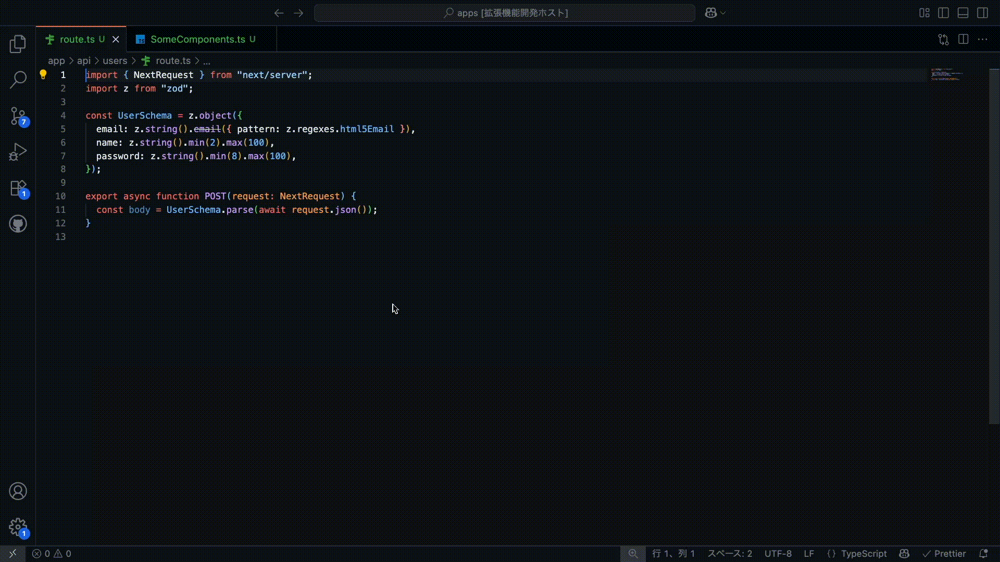

# TypeView

**TypeScript + Monorepository プロジェクトでAPIのリクエストボディ型をホバー表示するVS Code拡張機能**


[日本語版README](./README_ja.md) | [English README](./README.md)

## 🚀 機能

- **ホバー型表示**: `fetch("/api/...")` の部分にマウスをホバーすると、TypeScriptのリクエストボディ型が表示されます
- **Next.js App Routerサポート**: Next.js App RouterのAPIルートとシームレスに連携
- **TypeScriptパスエイリアス解決**: tsconfig.jsonで定義された `@/` などのパスエイリアスをサポート



## 📦 インストール

1. VS Codeを開く
2. 拡張機能を開く (Ctrl+Shift+X / Cmd+Shift+X)
3. "TypeView" を検索
4. インストールをクリック

または[VS Code マーケットプレース](https://marketplace.visualstudio.com/items?itemName=Ayumu3746221.typeview)から直接インストールできます。

## ⚙️ 設定

ワークスペースの `.vscode/settings.json` に以下の設定を追加してください：

```json
{
  "typeview.framework": "nextjs-app-router",
  "typeview.routeDirectories": ["app/api"]
}
```

### 設定項目

| 設定名 | 説明 | デフォルト値 |
|--------|------|-------------|
| `typeview.framework` | 使用するバックエンドフレームワーク | `"nextjs-app-router"` |
| `typeview.routeDirectories` | APIルートディレクトリ（ワークスペースルートからの相対パス） | `[]` |

## 🎯 使い方

1. ワークスペース設定を行う（上記参照）
2. TypeScript/TSXファイルを開く
3. `fetch("/api/users")` のようなコードを書く
4. APIパスの部分にホバーすると、リクエストボディの型定義が表示されます

### 使用例

```typescript
// コンポーネント内で
const handleSubmit = async (userData: UserCreateInput) => {
  const response = await fetch("/api/users", {  // <- ここにホバー！
    method: "POST",
    body: JSON.stringify(userData)
  });
};
```

`"/api/users"` にホバーすると、以下のような型情報が表示されます：

```typescript
interface UserCreateInput {
  name: string;
  email: string;
  age?: number;
}
```

## 📁 プロジェクト構成

プロジェクトは以下のような構成である必要があります：

```
your-project/
├── app/
│   └── api/
│       └── users/
│           └── route.ts        # APIルートファイル
├── lib/
│   └── types/
│       └── UserCreateInput.ts  # 型定義ファイル
└── .vscode/
    └── settings.json           # TypeView設定
```

### APIルートの例 (`app/api/users/route.ts`)

```typescript
import { UserCreateInput } from '@/lib/types/UserCreateInput';

export async function POST(req: Request) {
  const body: UserCreateInput = await req.json();  // <- TypeViewがこのパターンを検出
  
  // APIのロジックをここに
  return Response.json({ success: true });
}
```

## 🚧 プレビュー版について

これはTypeViewの**プレビュー版**です。拡張機能の改善のため、積極的にフィードバックを求めています。

### 現在の制限事項

- 現在は `const body: Type = await req.json()` パターンのみサポート
- Next.js App Routerのみ対応
- `.ts` および `.tsx` ファイル拡張子のみ対応

### 予定されている機能

- Zero Config（設定不要）でのサポート
- 型アサーション（`as Type`）のサポート
- Zod等のサイバーサイド側の型変換のサポート
- Axios等のfetch関数以外のHttpリクエストをサポート
- Honoなど他フレームワークのサポート
- より柔軟なコードパターン認識
- エラーハンドリングと診断機能の向上

## 🤝 コントリビュート

コントリビュートを歓迎します！[GitHubリポジトリ](https://github.com/Ayumu3746221/TypeView)で以下をお待ちしています：

- 🐛 バグレポート
- 💡 機能リクエスト
- 🔧 プルリクエスト
- 📖 ドキュメント改善

## 📝 ライセンス

MIT License - 詳細は [LICENSE](./LICENSE) をご覧ください。

## 🙋‍♂️ サポート

- 🐛 [Issue報告](https://github.com/Ayumu3746221/TypeView/issues)
- 💬 [ディスカッション](https://github.com/Ayumu3746221/TypeView/discussions)
- ⭐ 役に立ったらプロジェクトにスターをお願いします！

---

**より良い型表示でコーディングを楽しんでください！ 🎉**