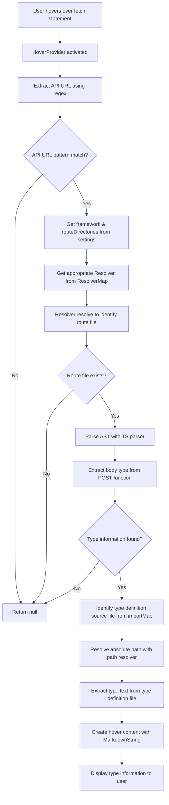
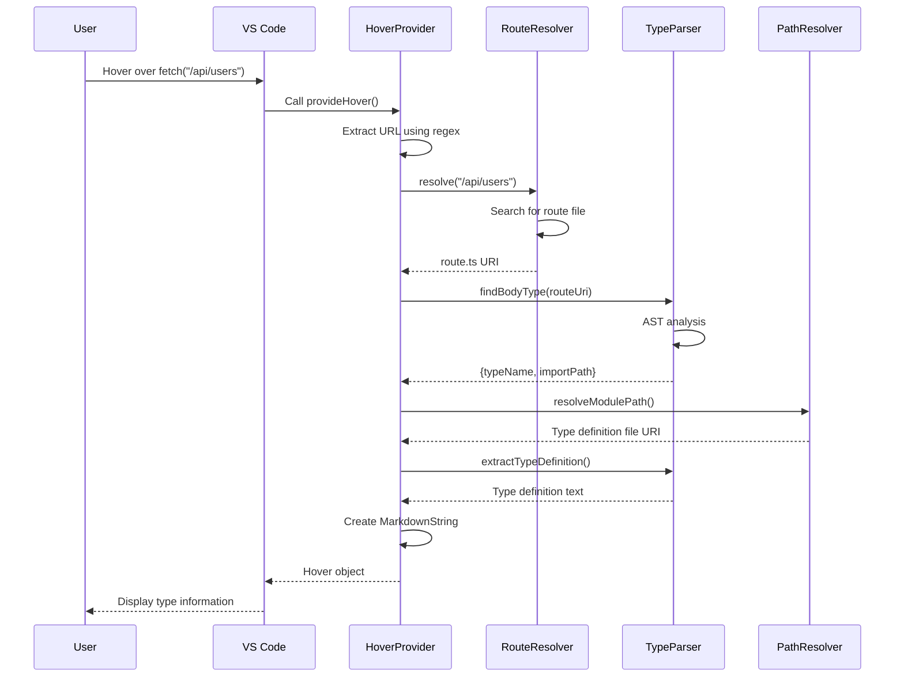

# TypeView Architecture

## Overview

TypeView is a VS Code extension that displays type information for API endpoints in TypeScript projects when hovering over them.

## Overall Processing Flow

## Main Components

### 1. HoverProvider (`src/extension.ts`)
- Entry point
- Integration with VS Code API
- Controls overall processing flow

### 2. RouteResolver (`src/resolvers/`)
- Mapping from API URLs to backend files
- Implements framework-specific routing rules
- Currently supported: Next.js App Router

### 3. TypeScript Parser (`src/parser/ts-parser.ts`)
- TypeScript AST analysis
- Type annotation extraction from POST functions
- Import statement analysis

### 4. PathResolver (`src/utils/path-resolver.ts`)
- tsconfig.json path alias resolution
- Conversion from relative paths to absolute paths

## Data Flow

## Configuration and Customization

### Configuration Parameters
- `typeview.framework`: Framework to use
- `typeview.routeDirectories`: API route directories

### Extension Points
1. **New framework support**: Implement `IRouteResolver`
2. **New type patterns**: Extend patterns in `ts-parser.ts`
3. **New path resolver**: Extend `path-resolver.ts`

## Error Handling

Errors at each stage are handled by returning `undefined`, ultimately resulting in no hover display.
This ensures that normal development flow is not interrupted, and type information is displayed only when available.
