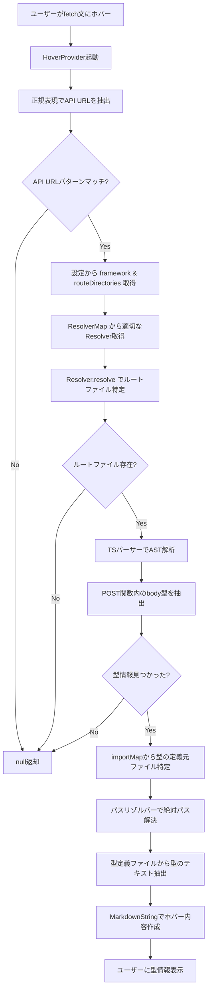
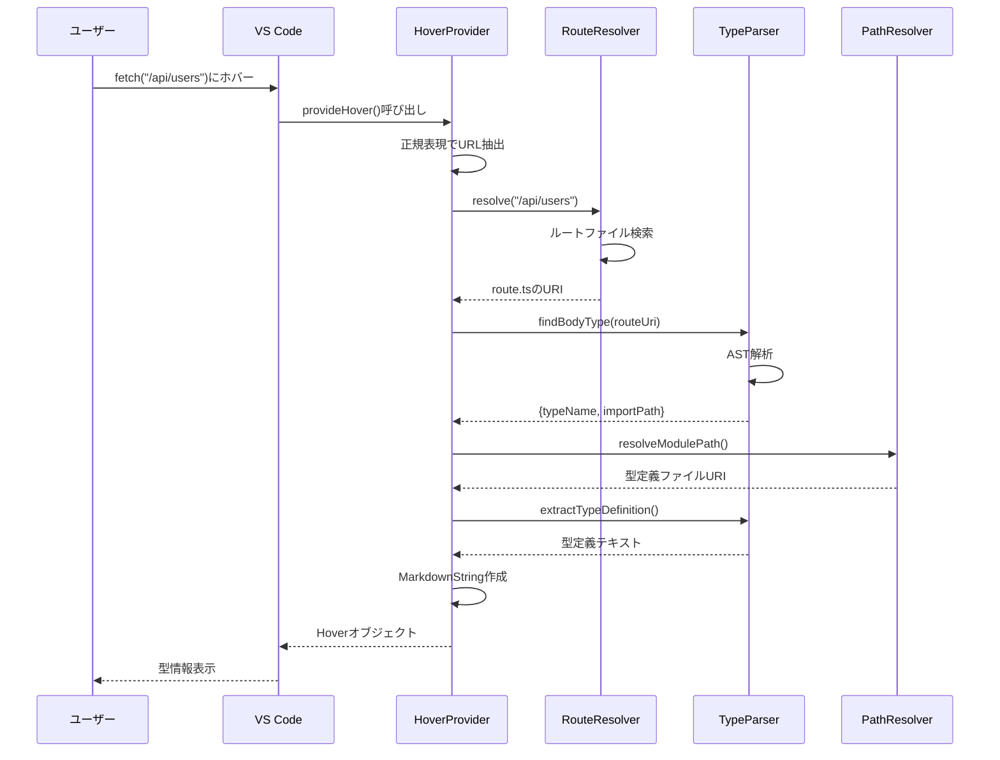

# TypeView アーキテクチャ

## 概要

TypeViewは、TypeScriptプロジェクトでAPIエンドポイントの型情報をホバー表示するVS Code拡張機能です。

## 全体の処理フロー

## 主要コンポーネント

### 1. HoverProvider (`src/extension.ts`)
- エントリーポイント
- VS Code APIとの統合
- 全体の処理フローを制御

### 2. RouteResolver (`src/resolvers/`)
- API URLからバックエンドファイルへのマッピング
- フレームワーク固有のルーティング規則を実装
- 現在サポート: Next.js App Router

### 3. TypeScript Parser (`src/parser/ts-parser.ts`)
- TypeScript ASTの解析
- POST関数内の型注釈抽出
- import文の解析

### 4. PathResolver (`src/utils/path-resolver.ts`)
- tsconfig.jsonのパスエイリアス解決
- 相対パスから絶対パスへの変換

## データフロー

## 設定とカスタマイズ

### 設定パラメータ
- `typeview.framework`: 使用フレームワーク
- `typeview.routeDirectories`: APIルートディレクトリ

### 拡張ポイント
1. **新しいフレームワークサポート**: `IRouteResolver`を実装
2. **新しい型パターン**: `ts-parser.ts`のパターン拡張
3. **新しいパスリゾルバー**: `path-resolver.ts`の拡張

## エラーハンドリング

各段階でのエラーは`undefined`を返すことで処理され、最終的にホバー表示がされません。
これにより、通常の開発フローを妨げることなく、型情報が利用可能な場合のみ表示されます。