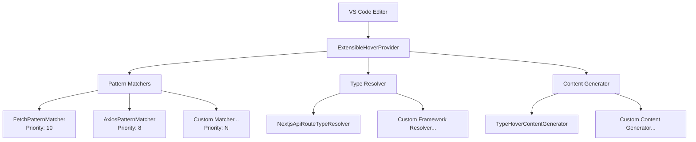

# 🎯 TypeView OSS Developer Guide

**A comprehensive guide for new contributors to understand TypeView's extensible hover architecture, processing flows, and development patterns.**

Welcome to the TypeView development community! This guide will help you understand the codebase structure, architectural decisions, and contribution patterns to get you productive quickly.

## 📋 Table of Contents

1. [Architecture Overview](#-architecture-overview)
2. [Processing Flow](#-processing-flow)
3. [Component Responsibilities](#-component-responsibilities)
4. [Extension Patterns](#-extension-patterns)
5. [Testing Strategy](#-testing-strategy)
6. [Development Workflow](#-development-workflow)
7. [VS Code Integration](#-vs-code-integration)

---

## 🏗️ Architecture Overview

TypeView uses an **extensible architecture** based on the **Strategy Pattern** and **Dependency Injection**, allowing for easy addition of new HTTP libraries, frameworks, and content generation strategies.

### Core Design Principles

- ✅ **Open/Closed Principle**: Open for extension, closed for modification
- ✅ **Single Responsibility**: Each component has a clear, focused purpose
- ✅ **Dependency Inversion**: Depend on abstractions, not concretions
- ✅ **Priority System**: Control execution order across multiple implementations

### Architecture Diagram



### Key Architectural Components

```typescript
// Main orchestrator with dependency injection
class ExtensibleHoverProvider implements vscode.HoverProvider {
  constructor(
    private patternMatchers: IHoverPatternMatcher[], // Strategy: HTTP pattern detection
    private typeResolver: ITypeInfoResolver, // Strategy: Type information extraction
    private contentGenerator: IHoverContentGenerator // Strategy: Markdown content generation
  ) {
    // Sort by priority for optimal execution order
    this.patternMatchers.sort((a, b) => b.priority - a.priority);
  }
}
```

---

## ⚡ Processing Flow

### 1. Hover Request Reception

```typescript
async provideHover(
  document: vscode.TextDocument,
  position: vscode.Position
): Promise<vscode.Hover | null>
```

When a user hovers over code in VS Code, the extension receives this callback with the document context and cursor position.

### 2. Pattern Matching (Priority-Ordered)

```typescript
// Execute matchers in descending priority order (already sorted)
for (const matcher of this.patternMatchers) {
  // Language filtering for performance
  if (matcher.getSupportedLanguages().includes(document.languageId)) {
    uri = matcher.extractUri(line, position.character);
    if (uri) {
      this.logInfo(`Pattern matched by ${matcher.name}: ${uri}`);
      break; // First match wins - proceed with this URI
    }
  }
}
```

**Priority Examples**:

- `FetchPatternMatcher`: Priority 10 (Native API, highest priority)
- `AxiosPatternMatcher`: Priority 8 (Popular library)
- Custom matchers: Configure as needed

### 3. Type Information Resolution

```typescript
// Extract type information from the matched URI
contentSource = await this.typeResolver.resolveTypeInfo(uri);

// Example result:
// {
//   typeName: "UserCreateRequest",
//   definition: "interface UserCreateRequest { name: string; email: string; }",
//   sourceInfo: "From: @/types/user"
// }
```

### 4. Hover Content Generation

```typescript
// Generate VS Code-compatible markdown content
const markdownString = this.contentGenerator.generateHoverContent(
  uri,
  contentSource
);
return new vscode.Hover(markdownString);
```

### 5. Error Handling & Logging

```typescript
catch (error) {
  this.logError(`Failed at stage: ${stageName}`, error);
  // Graceful degradation - continue to next candidate or return null
}
```

---

## 🎯 Component Responsibilities

### ExtensibleHoverProvider (`src/hover/ExtensibleHoverProvider.ts`)

**Primary Responsibility**: Main controller and orchestrator

**Key Features**:

- Dependency injection container
- VS Code OutputChannel logging
- Error handling and graceful degradation
- Position validation and language filtering

```typescript
class ExtensibleHoverProvider implements vscode.HoverProvider {
  private outputChannel: vscode.OutputChannel;

  constructor(
    private patternMatchers: IHoverPatternMatcher[],
    private typeResolver: ITypeInfoResolver,
    private contentGenerator: IHoverContentGenerator
  ) {
    // Initialize logging system
    this.outputChannel = vscode.window.createOutputChannel("TypeView");

    // Sort matchers by priority for optimal execution
    this.patternMatchers.sort((a, b) => b.priority - a.priority);
  }

  // Professional logging for debugging
  private logError(message: string, error: any): void {
    this.outputChannel.appendLine(
      `[ERROR] ${new Date().toISOString()} ${message}: ${error}`
    );
  }

  private logInfo(message: string): void {
    this.outputChannel.appendLine(
      `[INFO] ${new Date().toISOString()} ${message}`
    );
  }
}
```

**Critical Methods**:

- `provideHover()`: Main processing pipeline
- `logError()`, `logInfo()`: Professional VS Code logging
- Position validation and bounds checking

---

### IHoverPatternMatcher (`src/matchers/IHoverPatternMatcher.ts`)

**Primary Responsibility**: HTTP request pattern detection and URI extraction

```typescript
interface IHoverPatternMatcher {
  readonly name: string; // Unique identifier for debugging
  readonly priority: number; // Execution priority (higher = earlier)

  extractUri(line: string, position: number): string | undefined;
  getSupportedLanguages(): string[]; // Language filtering for performance
}
```

**Implementation Examples**:

```typescript
// Fetch API detection
class FetchPatternMatcher implements IHoverPatternMatcher {
  readonly name = "fetch-pattern";
  readonly priority = 10; // High priority for native API

  extractUri(line: string, position: number): string | undefined {
    // Match: fetch("/api/users") or fetch('/api/users')
    const match = line.match(/fetch\s*\(\s*['"](\/api[^'"]*)['"]/);
    return match?.[1];
  }

  getSupportedLanguages(): string[] {
    return ["typescript", "typescriptreact"];
  }
}

// Axios library detection
class AxiosPatternMatcher implements IHoverPatternMatcher {
  readonly name = "axios-pattern";
  readonly priority = 8; // Lower than fetch but still high

  extractUri(line: string, position: number): string | undefined {
    // Match: axios.post("/api/users") or client.get("/api/users")
    const match = line.match(
      /\w+\.(?:get|post|put|delete|patch)\s*\(\s*['"](\/api[^'"]*)['"]/
    );
    return match?.[1];
  }

  getSupportedLanguages(): string[] {
    return ["typescript", "typescriptreact", "javascript", "javascriptreact"];
  }
}
```

---

### ITypeInfoResolver (`src/type-resolver/ITypeInfoResolver.ts`)

**Primary Responsibility**: Resolve type information from API route URIs

```typescript
interface ITypeInfoResolver {
  resolveTypeInfo(uri: string): Promise<HoverContentSource | undefined>;
}

type HoverContentSource = {
  typeName: string; // "UserCreateRequest"
  definition: string; // "interface UserCreateRequest { ... }"
  sourceInfo: string; // "From: types/user.ts"
};
```

**Resolution Strategy Pipeline**:

1. **Import Type Detection** → Resolve tsconfig path aliases → Load and parse files
2. **Local Type Detection** → Search same file for interface/type definitions
3. **Schema Detection** → Extract Zod schemas, JSDoc types, etc.

```typescript
class NextjsApiRouteTypeResolver implements ITypeInfoResolver {
  async resolveTypeInfo(uri: string): Promise<HoverContentSource | undefined> {
    // 1. Find corresponding API route file
    const routeFile = await this.findRouteFileForUri(uri);
    if (!routeFile) return undefined;

    // 2. Parse TypeScript AST
    const content = await vscode.workspace.fs.readFile(routeFile);
    const sourceFile = this.parseTypeScript(content.toString());

    // 3. Extract type information using multiple strategies
    const typeInfo = await this.extractTypeInfo(sourceFile);

    return typeInfo;
  }
}
```

---

### IHoverContentGenerator (`src/hover/IHoverContentGenerator.ts`)

**Primary Responsibility**: Generate VS Code-compatible markdown content

```typescript
interface IHoverContentGenerator {
  generateHoverContent(
    uri: string,
    contentSource: HoverContentSource
  ): vscode.MarkdownString;
}
```

**Content Generation Example**:

```typescript
class TypeHoverContentGenerator implements IHoverContentGenerator {
  generateHoverContent(
    uri: string,
    source: HoverContentSource
  ): vscode.MarkdownString {
    const md = new vscode.MarkdownString();
    md.isTrusted = true; // Enable advanced markdown features

    // Header with API endpoint
    md.appendMarkdown(`**Request Body Type** for \`${uri}\`\n\n`);

    // Type definition with syntax highlighting
    md.appendCodeblock(source.definition, "typescript");

    // Source information
    md.appendMarkdown(`\n*${source.sourceInfo}*`);

    return md;
  }
}
```

**Generated Output Example**:

````markdown
**Request Body Type** for `/api/users`

```typescript
interface UserCreateRequest {
  name: string;
  email: string;
  age?: number;
}
```
````

_From: @/types/user_

````

---

## 🔧 Extension Patterns

### Adding Support for New HTTP Libraries

**Example: Adding Superagent Support**

```typescript
// 1. Implement the pattern matcher
class SuperagentPatternMatcher implements IHoverPatternMatcher {
  readonly name = "superagent-pattern";
  readonly priority = 7;  // Lower than axios, higher than custom

  extractUri(line: string, position: number): string | undefined {
    // Match: request.get('/api/users') patterns
    const match = line.match(/request\.(?:get|post|put|delete)\s*\(\s*['"](\/api[^'"]*)['"]/);
    return match?.[1];
  }

  getSupportedLanguages(): string[] {
    return ["typescript", "typescriptreact", "javascript", "javascriptreact"];
  }
}

// 2. Register in extension.ts
const patternMatchers: IHoverPatternMatcher[] = [
  new FetchPatternMatcher(),
  new AxiosPatternMatcher(),
  new SuperagentPatternMatcher(),  // Add your new matcher
];
````

### Adding Support for New Frameworks

**Example: Adding Hono Framework Support**

```typescript
// 1. Implement framework-specific type resolver
class HonoTypeResolver implements ITypeInfoResolver {
  async resolveTypeInfo(uri: string): Promise<HoverContentSource | undefined> {
    // Convert URI to Hono route pattern
    const routePath = this.convertToHonoRoute(uri);

    // Extract Zod schema from Hono route definition
    const schemaInfo = await this.extractHonoSchema(routePath);

    if (schemaInfo) {
      return {
        typeName: schemaInfo.name,
        definition: schemaInfo.definition,
        sourceInfo: `Hono Route: ${routePath}`,
      };
    }

    return undefined;
  }

  private convertToHonoRoute(uri: string): string {
    // Convert /api/users to Hono route pattern
    return uri.replace(/^\/api/, "");
  }

  private async extractHonoSchema(routePath: string): Promise<any> {
    // Implementation specific to Hono's schema definition patterns
  }
}

// 2. Add to TypeResolverFactory
class TypeResolverFactory {
  static createResolver(
    framework: string,
    routeFunction: Function
  ): ITypeInfoResolver | undefined {
    switch (framework) {
      case "nextjs-app-router":
        return new NextjsApiRouteTypeResolver(routeFunction);
      case "hono":
        return new HonoTypeResolver(routeFunction); // New resolver
      default:
        return undefined;
    }
  }

  static getSupportedFrameworks(): string[] {
    return ["nextjs-app-router", "hono"]; // Update supported list
  }
}
```

### Creating Custom Content Generators

**Example: Themed Content Generator**

```typescript
class ThemedContentGenerator implements IHoverContentGenerator {
  constructor(private theme: "minimal" | "detailed" | "japanese") {}

  generateHoverContent(
    uri: string,
    source: HoverContentSource
  ): vscode.MarkdownString {
    const md = new vscode.MarkdownString();
    md.isTrusted = true;

    switch (this.theme) {
      case "minimal":
        // Just show the type definition
        md.appendCodeblock(source.definition, "typescript");
        break;

      case "detailed":
        // Rich formatting with emojis and detailed structure
        md.appendMarkdown(`## 🎯 **${source.typeName}**\n`);
        md.appendMarkdown(`**Endpoint**: \`${uri}\`\n\n`);
        md.appendCodeblock(source.definition, "typescript");
        md.appendMarkdown(`\n📁 **Source**: ${source.sourceInfo}`);
        break;

      case "japanese":
        // Localized content
        md.appendMarkdown(`**APIリクエスト型** \`${uri}\`\n\n`);
        md.appendCodeblock(source.definition, "typescript");
        md.appendMarkdown(`\n*ソース: ${source.sourceInfo}*`);
        break;
    }

    return md;
  }
}
```

---

## 🧪 Testing Strategy

### Test Structure

```
src/test/
├── unit/                    # Unit tests for individual components
│   ├── matchers/           # Pattern matcher tests
│   ├── type-resolver/      # Type resolver tests
│   └── hover/              # Content generator tests
├── integration/            # Integration tests
│   └── ExtensibleHover...  # Full component integration
└── fixtures/               # Test data and mock files
    ├── api-routes/
    └── mock-documents/
```

### VS Code Testing Constraints

⚠️ **Critical**: VS Code test environment has specific limitations

```typescript
// ❌ FORBIDDEN - beforeEach is not available
suite("Test Suite", () => {
  let component: SomeComponent;

  beforeEach(() => {
    // ← ReferenceError: beforeEach is not defined
    component = new SomeComponent();
  });

  test("should work", () => {
    // This will fail in VS Code environment
  });
});

// ✅ CORRECT PATTERN - Inline initialization
suite("Test Suite", () => {
  test("should work correctly", () => {
    const component = new SomeComponent(); // Initialize per test

    const result = component.doSomething();

    assert.ok(result);
  });
});
```

### Mock Document Creation Pattern

```typescript
const createMockDocument = (
  content: string,
  languageId = "typescript",
  uri = vscode.Uri.file("/test/file.ts")
) => {
  const lines = content.split("\n");

  return {
    getText: () => content,
    lineAt: (line: number) => ({
      text: lines[line] || "",
      lineNumber: line,
    }),
    lineCount: lines.length,
    languageId,
    uri,
    validatePosition: (pos: vscode.Position) => pos,
    // Add other required TextDocument methods as needed
  } as vscode.TextDocument;
};
```

### Test Pattern Examples

**1. Pattern Matcher Unit Tests**:

```typescript
suite("FetchPatternMatcher", () => {
  test("should extract URIs from various fetch patterns", () => {
    const matcher = new FetchPatternMatcher();

    const testCases = [
      { line: 'fetch("/api/users")', expected: "/api/users" },
      {
        line: 'await fetch("/api/posts", { method: "POST" })',
        expected: "/api/posts",
      },
      { line: "const response = fetch('/api/data')", expected: "/api/data" },
      { line: 'regular string "/api/users"', expected: undefined }, // Should not match
    ];

    testCases.forEach(({ line, expected }) => {
      const result = matcher.extractUri(line, 10);
      assert.strictEqual(result, expected, `Failed for line: ${line}`);
    });
  });

  test("should support correct languages", () => {
    const matcher = new FetchPatternMatcher();
    const languages = matcher.getSupportedLanguages();

    assert.ok(languages.includes("typescript"));
    assert.ok(languages.includes("typescriptreact"));
  });
});
```

**2. Integration Tests**:

```typescript
suite("ExtensibleHoverProvider Integration", () => {
  test("should provide hover for complete flow", async () => {
    // Create mock dependencies
    const mockTypeResolver: ITypeInfoResolver = {
      async resolveTypeInfo(uri: string) {
        return {
          typeName: "UserRequest",
          definition: "interface UserRequest { name: string; }",
          sourceInfo: "Mock source",
        };
      },
    };

    const mockContentGenerator: IHoverContentGenerator = {
      generateHoverContent(uri: string, source: HoverContentSource) {
        const md = new vscode.MarkdownString();
        md.appendCodeblock(source.definition, "typescript");
        return md;
      },
    };

    // Create provider with real pattern matchers
    const provider = new ExtensibleHoverProvider(
      [new FetchPatternMatcher()],
      mockTypeResolver,
      mockContentGenerator
    );

    // Test with realistic document content
    const document = createMockDocument('await fetch("/api/users");');
    const position = new vscode.Position(0, 12); // Position within the URI

    const hover = await provider.provideHover(document, position);

    assert.ok(hover !== null, "Should provide hover");
    assert.ok(hover.contents[0] instanceof vscode.MarkdownString);
  });

  test("should handle resolver failures gracefully", async () => {
    const failingResolver: ITypeInfoResolver = {
      async resolveTypeInfo(): Promise<HoverContentSource | undefined> {
        throw new Error("Resolver failed");
      },
    };

    const provider = new ExtensibleHoverProvider(
      [new FetchPatternMatcher()],
      failingResolver,
      new TypeHoverContentGenerator()
    );

    const document = createMockDocument('fetch("/api/test");');
    const hover = await provider.provideHover(
      document,
      new vscode.Position(0, 7)
    );

    // Should gracefully return null on error
    assert.strictEqual(hover, null);
  });
});
```

**3. Error Handling Tests**:

```typescript
suite("Error Handling", () => {
  test("should log errors to OutputChannel", async () => {
    let loggedMessages: string[] = [];

    // Mock OutputChannel for testing
    const mockOutputChannel = {
      appendLine: (message: string) => loggedMessages.push(message),
      show: () => {},
      dispose: () => {},
    } as vscode.OutputChannel;

    // Create provider with failing dependencies
    const provider = new ExtensibleHoverProvider(
      [],
      failingResolver,
      generator
    );
    // Inject mock output channel (would need dependency injection support)

    await provider.provideHover(document, position);

    // Verify error was logged
    assert.ok(loggedMessages.some((msg) => msg.includes("[ERROR]")));
  });
});
```

---

## 🔄 Development Workflow

### 1. Environment Setup

```bash
# Clone repository
git clone https://github.com/Ayumu3746221/TypeView.git
cd TypeView

# Install dependencies
npm install

# Verify setup
npm run compile          # Compile TypeScript
npm run compile-tests    # Compile test files
npm test                 # Run all tests (should see 100+ passing)
```

### 2. Development Cycle

```bash
# 1. Feature Development
npm run compile          # Incremental compilation
# OR
npm run watch            # Watch mode for continuous compilation

# 2. Test Development & Execution
npm run compile-tests    # Compile test TypeScript
npm test                 # Run full test suite
# OR
npm run test:watch       # Watch mode for tests

# 3. Code Quality
npm run lint             # ESLint check
npm run format           # Prettier formatting (if configured)
```

### 3. Debugging Methods

**VS Code Extension Debugging**:

1. Open VS Code in the project directory
2. Press `F5` to launch Extension Development Host
3. In the new VS Code window, open a TypeScript project
4. Write code with API calls: `fetch("/api/users")`
5. Hover over the API path
6. Check `View` → `Output` → `TypeView` for detailed logs

**Debug Log Example**:

```
[INFO] 2025-01-16T12:00:00.000Z Pattern matched by fetch-pattern: /api/users
[INFO] 2025-01-16T12:00:00.100Z Type resolved for /api/users: UserRequest
[INFO] 2025-01-16T12:00:00.200Z Hover content generated for /api/users
```

**Troubleshooting Common Issues**:

```typescript
// Check if pattern matching is working
this.logInfo(`Testing pattern matching on line: "${line}"`);
this.logInfo(`Character position: ${position.character}`);

// Check if type resolution is finding files
this.logInfo(`Looking for route file: ${uri}`);
this.logInfo(`Found route file: ${routeFile?.fsPath}`);

// Check if content generation is working
this.logInfo(`Generated content length: ${content.value.length}`);
```

### 4. Testing Best Practices

**Always Test Your Changes**:

```bash
# Run specific test suites
npm test -- --grep "PatternMatcher"      # Test only pattern matchers
npm test -- --grep "Integration"        # Test only integration tests

# Run tests with detailed output
npm test -- --reporter spec             # Detailed test output
```

**Test Coverage Guidelines**:

- ✅ **Unit Tests**: Every new pattern matcher, resolver, and generator
- ✅ **Integration Tests**: Full component interaction scenarios
- ✅ **Error Cases**: Network failures, file not found, parsing errors
- ✅ **Edge Cases**: Empty strings, invalid URIs, unsupported languages

### 5. Contribution Guidelines

**Before Submitting Pull Requests**:

- ✅ All tests must pass (`npm test`)
- ✅ New features must include corresponding tests
- ✅ Maintain TypeScript type safety (no `any` types)
- ✅ Don't break existing interfaces
- ✅ Use VS Code OutputChannel for logging (no `console.log`)
- ✅ Follow existing code style and patterns

**Commit Message Format**:

```
feat: add Superagent pattern matcher support

- Implement SuperagentPatternMatcher for request.get() patterns
- Add comprehensive test coverage with 15 test cases
- Update documentation with usage examples
- Maintain backward compatibility with existing matchers

Closes #42
```

**Pull Request Description Template**:

```markdown
## 🎯 Changes Made

- [ ] Added new pattern matcher for [Library Name]
- [ ] Updated type resolver for [Framework Name]
- [ ] Fixed bug in [Component Name]

## 🧪 Testing

- [ ] All existing tests pass
- [ ] Added new test cases (specify count)
- [ ] Manual testing completed in Extension Development Host

## 📖 Documentation

- [ ] Updated README.md if user-facing changes
- [ ] Updated DEVELOPER_GUIDE.md if architecture changes
- [ ] Added code comments for complex logic

## ✅ Checklist

- [ ] No breaking changes to existing APIs
- [ ] TypeScript compilation successful
- [ ] ESLint passes without errors
- [ ] Followed VS Code extension best practices
```

### 6. Release Process

```bash
# 1. Version Update
npm version patch   # 0.1.0 → 0.1.1 (bug fixes)
npm version minor   # 0.1.0 → 0.2.0 (new features)
npm version major   # 0.1.0 → 1.0.0 (breaking changes)

# 2. Final Testing
npm test
npm run compile

# 3. Create VS Code Extension Package
npx vsce package

# 4. Publish to VS Code Marketplace
npx vsce publish

# 5. Create GitHub Release
git push origin main --tags
# Create release notes on GitHub
```

---

## 🔌 VS Code Integration

### Extension Manifest Configuration

**Key `package.json` sections**:

```json
{
  "contributes": {
    "configuration": {
      "title": "TypeView",
      "properties": {
        "typeview.framework": {
          "type": "string",
          "default": "nextjs-app-router",
          "description": "Backend framework type"
        },
        "typeview.routeDirectories": {
          "type": "array",
          "items": { "type": "string" },
          "default": [],
          "description": "API route directories"
        }
      }
    }
  },
  "activationEvents": ["onLanguage:typescript", "onLanguage:typescriptreact"]
}
```

### Extension Lifecycle

**Activation Process** (`extension.ts`):

```typescript
export function activate(context: vscode.ExtensionContext) {
  // 1. Read configuration
  const config = vscode.workspace.getConfiguration("typeview");
  const framework = config.get<string>("framework");

  // 2. Initialize pattern matchers
  const patternMatchers: IHoverPatternMatcher[] = [
    new FetchPatternMatcher(),
    new AxiosPatternMatcher(),
  ];

  // 3. Create framework-specific resolver
  const typeResolver = TypeResolverFactory.createResolver(
    framework,
    findRouteFileForUri
  );

  // 4. Create content generator
  const contentGenerator = new TypeHoverContentGenerator();

  // 5. Create and register hover provider
  const hoverProvider = new ExtensibleHoverProvider(
    patternMatchers,
    typeResolver,
    contentGenerator
  );

  // 6. Register for supported languages
  const supportedLanguages = new Set<string>();
  patternMatchers.forEach((matcher) =>
    matcher
      .getSupportedLanguages()
      .forEach((lang) => supportedLanguages.add(lang))
  );

  const registration = vscode.languages.registerHoverProvider(
    Array.from(supportedLanguages),
    hoverProvider
  );

  context.subscriptions.push(registration);
}

export function deactivate() {
  // Cleanup resources if needed
}
```

### Performance Considerations

**Language Filtering**:

```typescript
// Only process supported languages
if (!matcher.getSupportedLanguages().includes(document.languageId)) {
  continue; // Skip this matcher
}
```

**Early Exit Strategies**:

```typescript
// Exit early if no API patterns found
if (!line.includes("/api")) {
  return null;
}

// Cache expensive operations
private routeFileCache = new Map<string, vscode.Uri>();
```

**Async Operations**:

```typescript
// Use Promise.all for parallel processing when safe
const typeInfoPromises = candidates.map((uri) =>
  this.typeResolver.resolveTypeInfo(uri)
);
const results = await Promise.all(typeInfoPromises);
```

---

## 🎯 Summary

TypeView's extensible hover architecture provides:

- **🏗️ Extensibility**: Easy addition of new HTTP libraries and frameworks
- **🔧 Maintainability**: Clear component responsibilities with comprehensive testing
- **⚡ Performance**: Priority-based execution with language filtering
- **🛡️ Reliability**: Comprehensive error handling with professional logging
- **👥 Developer Experience**: Rich debugging tools and documentation

### Next Steps for New Contributors

1. **🚀 Quick Start**: Set up the development environment and run tests
2. **🔍 Explore Code**: Read through the main components and their tests
3. **🛠️ Make Changes**: Start with small improvements or bug fixes
4. **🧪 Test Thoroughly**: Ensure all tests pass and add new ones
5. **📝 Document**: Update documentation for any user-facing changes
6. **🤝 Contribute**: Submit pull requests following the guidelines

### Getting Help

- 🐛 **Issues**: [GitHub Issues](https://github.com/Ayumu3746221/TypeView/issues)
- 💬 **Discussions**: [GitHub Discussions](https://github.com/Ayumu3746221/TypeView/discussions)
- 📖 **Code**: Explore the well-documented source code and comprehensive test suite

Welcome to the TypeView community! We're excited to see your contributions. 🎉
