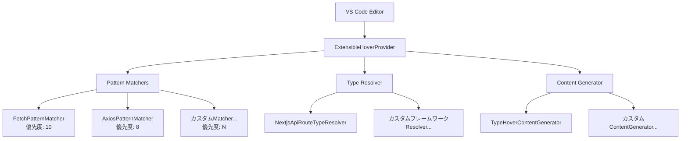

# 🎯 TypeView OSS 開発者ガイド

**新しいコントリビューターが TypeView の拡張可能ホバー機能のアーキテクチャ、処理フロー、開発パターンを理解するための包括的ガイドです。**

TypeView 開発コミュニティへようこそ！このガイドは、コードベース構造、アーキテクチャ設計、貢献パターンを理解し、迅速に生産性を高められるよう設計されています。

## 📋 目次

1. [アーキテクチャ概要](#-アーキテクチャ概要)
2. [処理フロー](#-処理フロー)
3. [コンポーネント責務](#-コンポーネント責務)
4. [拡張パターン](#-拡張パターン)
5. [テスト戦略](#-テスト戦略)
6. [開発ワークフロー](#-開発ワークフロー)
7. [VS Code 統合](#-vs-code統合)

---

## 🏗️ アーキテクチャ概要

TypeView は**Strategy Pattern**と**Dependency Injection**を基盤とした**拡張可能アーキテクチャ**を採用し、新しい HTTP ライブラリ、フレームワーク、コンテンツ生成戦略の追加を容易にしています。

### コア設計原則

- ✅ **開放閉鎖原則**: 拡張に開放、変更に閉鎖
- ✅ **単一責任原則**: 各コンポーネントが明確で集中した目的を持つ
- ✅ **依存性逆転原則**: 抽象に依存、具象実装に依存しない
- ✅ **優先度システム**: 複数実装間の実行順序を制御

### アーキテクチャ図



### 主要アーキテクチャコンポーネント

```typescript
// 依存性注入による主要オーケストレーター
class ExtensibleHoverProvider implements vscode.HoverProvider {
  constructor(
    private patternMatchers: IHoverPatternMatcher[], // 戦略: HTTPパターン検出
    private typeResolver: ITypeInfoResolver, // 戦略: 型情報抽出
    private contentGenerator: IHoverContentGenerator // 戦略: Markdownコンテンツ生成
  ) {
    // 最適な実行順序のため優先度でソート
    this.patternMatchers.sort((a, b) => b.priority - a.priority);
  }
}
```

---

## ⚡ 処理フロー

### 1. ホバー要求の受信

```typescript
async provideHover(
  document: vscode.TextDocument,
  position: vscode.Position
): Promise<vscode.Hover | null>
```

ユーザーが VS Code でコードにホバーすると、拡張機能はドキュメントコンテキストとカーソル位置でこのコールバックを受信します。

### 2. パターンマッチング（優先度順）

```typescript
// 優先度降順でマッチャーを実行（すでにソート済み）
for (const matcher of this.patternMatchers) {
  // パフォーマンスのための言語フィルタリング
  if (matcher.getSupportedLanguages().includes(document.languageId)) {
    uri = matcher.extractUri(line, position.character);
    if (uri) {
      this.logInfo(`Pattern matched by ${matcher.name}: ${uri}`);
      break; // 最初のマッチで勝利 - このURIで処理続行
    }
  }
}
```

**優先度例**:

- `FetchPatternMatcher`: 優先度 10 (ネイティブ API、最高優先度)
- `AxiosPatternMatcher`: 優先度 8 (人気ライブラリ)
- カスタムマッチャー: 必要に応じて設定

### 3. 型情報の解決

```typescript
// マッチしたURIから型情報を抽出
contentSource = await this.typeResolver.resolveTypeInfo(uri);

// 結果例:
// {
//   typeName: "UserCreateRequest",
//   definition: "interface UserCreateRequest { name: string; email: string; }",
//   sourceInfo: "From: @/types/user"
// }
```

### 4. ホバーコンテンツ生成

```typescript
// VS Code互換のmarkdownコンテンツを生成
const markdownString = this.contentGenerator.generateHoverContent(
  uri,
  contentSource
);
return new vscode.Hover(markdownString);
```

### 5. エラーハンドリング & ログ

```typescript
catch (error) {
  this.logError(`Failed at stage: ${stageName}`, error);
  // 優雅な劣化 - 次の候補に進むかnullを返却
}
```

---

## 🎯 コンポーネント責務

### ExtensibleHoverProvider (`src/hover/ExtensibleHoverProvider.ts`)

**主要責務**: メインコントローラーおよびオーケストレーター

**主要機能**:

- 依存性注入コンテナ
- VS Code OutputChannel ログ
- エラーハンドリングと優雅な劣化
- 位置検証と言語フィルタリング

```typescript
class ExtensibleHoverProvider implements vscode.HoverProvider {
  private outputChannel: vscode.OutputChannel;

  constructor(
    private patternMatchers: IHoverPatternMatcher[],
    private typeResolver: ITypeInfoResolver,
    private contentGenerator: IHoverContentGenerator
  ) {
    // ログシステムの初期化
    this.outputChannel = vscode.window.createOutputChannel("TypeView");

    // 最適実行のため優先度でマッチャーをソート
    this.patternMatchers.sort((a, b) => b.priority - a.priority);
  }

  // デバッグ用プロフェッショナルログ
  private logError(message: string, error: any): void {
    this.outputChannel.appendLine(
      `[ERROR] ${new Date().toISOString()} ${message}: ${error}`
    );
  }

  private logInfo(message: string): void {
    this.outputChannel.appendLine(
      `[INFO] ${new Date().toISOString()} ${message}`
    );
  }
}
```

**重要メソッド**:

- `provideHover()`: メイン処理パイプライン
- `logError()`, `logInfo()`: プロフェッショナル VS Code ログ
- 位置検証と境界チェック

---

### IHoverPatternMatcher (`src/matchers/IHoverPatternMatcher.ts`)

**主要責務**: HTTP リクエストパターン検出と URI 抽出

```typescript
interface IHoverPatternMatcher {
  readonly name: string; // デバッグ用一意識別子
  readonly priority: number; // 実行優先度（高い値 = より早い実行）

  extractUri(line: string, position: number): string | undefined;
  getSupportedLanguages(): string[]; // パフォーマンス用言語フィルタリング
}
```

**実装例**:

```typescript
// Fetch API検出
class FetchPatternMatcher implements IHoverPatternMatcher {
  readonly name = "fetch-pattern";
  readonly priority = 10; // ネイティブAPI用高優先度

  extractUri(line: string, position: number): string | undefined {
    // マッチ: fetch("/api/users") または fetch('/api/users')
    const match = line.match(/fetch\s*\(\s*['"](\/api[^'"]*)['"]/);
    return match?.[1];
  }

  getSupportedLanguages(): string[] {
    return ["typescript", "typescriptreact"];
  }
}

// Axiosライブラリ検出
class AxiosPatternMatcher implements IHoverPatternMatcher {
  readonly name = "axios-pattern";
  readonly priority = 8; // fetchより低いが依然高い

  extractUri(line: string, position: number): string | undefined {
    // マッチ: axios.post("/api/users") または client.get("/api/users")
    const match = line.match(
      /\w+\.(?:get|post|put|delete|patch)\s*\(\s*['"](\/api[^'"]*)['"]/
    );
    return match?.[1];
  }

  getSupportedLanguages(): string[] {
    return ["typescript", "typescriptreact", "javascript", "javascriptreact"];
  }
}
```

---

### ITypeInfoResolver (`src/type-resolver/ITypeInfoResolver.ts`)

**主要責務**: API ルート URI から型情報を解決

```typescript
interface ITypeInfoResolver {
  resolveTypeInfo(uri: string): Promise<HoverContentSource | undefined>;
}

type HoverContentSource = {
  typeName: string; // "UserCreateRequest"
  definition: string; // "interface UserCreateRequest { ... }"
  sourceInfo: string; // "From: types/user.ts"
};
```

**解決戦略パイプライン**:

1. **Import 型検出** → tsconfig path エイリアス解決 → ファイル読み込みと解析
2. **ローカル型検出** → 同ファイル内の interface/type 定義検索
3. **スキーマ検出** → Zod スキーマ、JSDoc 型などの抽出

```typescript
class NextjsApiRouteTypeResolver implements ITypeInfoResolver {
  async resolveTypeInfo(uri: string): Promise<HoverContentSource | undefined> {
    // 1. 対応するAPIルートファイルを検索
    const routeFile = await this.findRouteFileForUri(uri);
    if (!routeFile) return undefined;

    // 2. TypeScript ASTを解析
    const content = await vscode.workspace.fs.readFile(routeFile);
    const sourceFile = this.parseTypeScript(content.toString());

    // 3. 複数戦略を使用して型情報を抽出
    const typeInfo = await this.extractTypeInfo(sourceFile);

    return typeInfo;
  }
}
```

---

### IHoverContentGenerator (`src/hover/IHoverContentGenerator.ts`)

**主要責務**: VS Code 互換 markdown コンテンツ生成

```typescript
interface IHoverContentGenerator {
  generateHoverContent(
    uri: string,
    contentSource: HoverContentSource
  ): vscode.MarkdownString;
}
```

**コンテンツ生成例**:

```typescript
class TypeHoverContentGenerator implements IHoverContentGenerator {
  generateHoverContent(
    uri: string,
    source: HoverContentSource
  ): vscode.MarkdownString {
    const md = new vscode.MarkdownString();
    md.isTrusted = true; // 高度なmarkdown機能を有効化

    // APIエンドポイント付きヘッダー
    md.appendMarkdown(`**Request Body Type** for \`${uri}\`\n\n`);

    // シンタックスハイライト付き型定義
    md.appendCodeblock(source.definition, "typescript");

    // ソース情報
    md.appendMarkdown(`\n*${source.sourceInfo}*`);

    return md;
  }
}
```

**生成出力例**:

````markdown
**Request Body Type** for `/api/users`

```typescript
interface UserCreateRequest {
  name: string;
  email: string;
  age?: number;
}
```
````

_From: @/types/user_

````

---

## 🔧 拡張パターン

### 新しいHTTPライブラリサポートの追加

**例: Superagentサポート追加**

```typescript
// 1. パターンマッチャーを実装
class SuperagentPatternMatcher implements IHoverPatternMatcher {
  readonly name = "superagent-pattern";
  readonly priority = 7;  // axiosより低く、カスタムより高い

  extractUri(line: string, position: number): string | undefined {
    // マッチ: request.get('/api/users') パターン
    const match = line.match(/request\.(?:get|post|put|delete)\s*\(\s*['"](\/api[^'"]*)['"]/);
    return match?.[1];
  }

  getSupportedLanguages(): string[] {
    return ["typescript", "typescriptreact", "javascript", "javascriptreact"];
  }
}

// 2. extension.tsで登録
const patternMatchers: IHoverPatternMatcher[] = [
  new FetchPatternMatcher(),
  new AxiosPatternMatcher(),
  new SuperagentPatternMatcher(),  // 新しいマッチャーを追加
];
````

### 新しいフレームワークサポートの追加

**例: Hono フレームワークサポート追加**

```typescript
// 1. フレームワーク固有の型リゾルバーを実装
class HonoTypeResolver implements ITypeInfoResolver {
  async resolveTypeInfo(uri: string): Promise<HoverContentSource | undefined> {
    // URIをHonoルートパターンに変換
    const routePath = this.convertToHonoRoute(uri);

    // Honoルート定義からZodスキーマを抽出
    const schemaInfo = await this.extractHonoSchema(routePath);

    if (schemaInfo) {
      return {
        typeName: schemaInfo.name,
        definition: schemaInfo.definition,
        sourceInfo: `Hono Route: ${routePath}`,
      };
    }

    return undefined;
  }

  private convertToHonoRoute(uri: string): string {
    // /api/users をHonoルートパターンに変換
    return uri.replace(/^\/api/, "");
  }

  private async extractHonoSchema(routePath: string): Promise<any> {
    // Honoのスキーマ定義パターンに特化した実装
  }
}

// 2. TypeResolverFactoryに追加
class TypeResolverFactory {
  static createResolver(
    framework: string,
    routeFunction: Function
  ): ITypeInfoResolver | undefined {
    switch (framework) {
      case "nextjs-app-router":
        return new NextjsApiRouteTypeResolver(routeFunction);
      case "hono":
        return new HonoTypeResolver(routeFunction); // 新しいリゾルバー
      default:
        return undefined;
    }
  }

  static getSupportedFrameworks(): string[] {
    return ["nextjs-app-router", "hono"]; // サポートリストを更新
  }
}
```

### カスタムコンテンツジェネレーターの作成

**例: テーマ別コンテンツジェネレーター**

```typescript
class ThemedContentGenerator implements IHoverContentGenerator {
  constructor(private theme: "minimal" | "detailed" | "japanese") {}

  generateHoverContent(
    uri: string,
    source: HoverContentSource
  ): vscode.MarkdownString {
    const md = new vscode.MarkdownString();
    md.isTrusted = true;

    switch (this.theme) {
      case "minimal":
        // 型定義のみ表示
        md.appendCodeblock(source.definition, "typescript");
        break;

      case "detailed":
        // 絵文字と詳細構造でリッチフォーマット
        md.appendMarkdown(`## 🎯 **${source.typeName}**\n`);
        md.appendMarkdown(`**エンドポイント**: \`${uri}\`\n\n`);
        md.appendCodeblock(source.definition, "typescript");
        md.appendMarkdown(`\n📁 **ソース**: ${source.sourceInfo}`);
        break;

      case "japanese":
        // ローカライズされたコンテンツ
        md.appendMarkdown(`**APIリクエスト型** \`${uri}\`\n\n`);
        md.appendCodeblock(source.definition, "typescript");
        md.appendMarkdown(`\n*ソース: ${source.sourceInfo}*`);
        break;
    }

    return md;
  }
}
```

---

## 🧪 テスト戦略

### テスト構造

```
src/test/
├── unit/                    # 個別コンポーネント単体テスト
│   ├── matchers/           # パターンマッチャーテスト
│   ├── type-resolver/      # 型リゾルバーテスト
│   └── hover/              # コンテンツジェネレーターテスト
├── integration/            # 統合テスト
│   └── ExtensibleHover...  # 全コンポーネント統合
└── fixtures/               # テストデータとモックファイル
    ├── api-routes/
    └── mock-documents/
```

### VS Code テスト制約

⚠️ **重要**: VS Code テスト環境には特定の制限があります

```typescript
// ❌ 禁止 - beforeEachは利用不可
suite("Test Suite", () => {
  let component: SomeComponent;

  beforeEach(() => {
    // ← ReferenceError: beforeEach is not defined
    component = new SomeComponent();
  });

  test("should work", () => {
    // これはVS Code環境では失敗します
  });
});

// ✅ 正しいパターン - インライン初期化
suite("Test Suite", () => {
  test("should work correctly", () => {
    const component = new SomeComponent(); // テストごとに初期化

    const result = component.doSomething();

    assert.ok(result);
  });
});
```

### モックドキュメント作成パターン

```typescript
const createMockDocument = (
  content: string,
  languageId = "typescript",
  uri = vscode.Uri.file("/test/file.ts")
) => {
  const lines = content.split("\n");

  return {
    getText: () => content,
    lineAt: (line: number) => ({
      text: lines[line] || "",
      lineNumber: line,
    }),
    lineCount: lines.length,
    languageId,
    uri,
    validatePosition: (pos: vscode.Position) => pos,
    // 必要に応じて他のTextDocumentメソッドを追加
  } as vscode.TextDocument;
};
```

### テストパターン例

**1. パターンマッチャー単体テスト**:

```typescript
suite("FetchPatternMatcher", () => {
  test("should extract URIs from various fetch patterns", () => {
    const matcher = new FetchPatternMatcher();

    const testCases = [
      { line: 'fetch("/api/users")', expected: "/api/users" },
      {
        line: 'await fetch("/api/posts", { method: "POST" })',
        expected: "/api/posts",
      },
      { line: "const response = fetch('/api/data')", expected: "/api/data" },
      { line: 'regular string "/api/users"', expected: undefined }, // マッチしないはず
    ];

    testCases.forEach(({ line, expected }) => {
      const result = matcher.extractUri(line, 10);
      assert.strictEqual(result, expected, `Failed for line: ${line}`);
    });
  });

  test("should support correct languages", () => {
    const matcher = new FetchPatternMatcher();
    const languages = matcher.getSupportedLanguages();

    assert.ok(languages.includes("typescript"));
    assert.ok(languages.includes("typescriptreact"));
  });
});
```

**2. 統合テスト**:

```typescript
suite("ExtensibleHoverProvider Integration", () => {
  test("should provide hover for complete flow", async () => {
    // モック依存性を作成
    const mockTypeResolver: ITypeInfoResolver = {
      async resolveTypeInfo(uri: string) {
        return {
          typeName: "UserRequest",
          definition: "interface UserRequest { name: string; }",
          sourceInfo: "Mock source",
        };
      },
    };

    const mockContentGenerator: IHoverContentGenerator = {
      generateHoverContent(uri: string, source: HoverContentSource) {
        const md = new vscode.MarkdownString();
        md.appendCodeblock(source.definition, "typescript");
        return md;
      },
    };

    // 実際のパターンマッチャーでプロバイダーを作成
    const provider = new ExtensibleHoverProvider(
      [new FetchPatternMatcher()],
      mockTypeResolver,
      mockContentGenerator
    );

    // 現実的なドキュメントコンテンツでテスト
    const document = createMockDocument('await fetch("/api/users");');
    const position = new vscode.Position(0, 12); // URI内の位置

    const hover = await provider.provideHover(document, position);

    assert.ok(hover !== null, "Should provide hover");
    assert.ok(hover.contents[0] instanceof vscode.MarkdownString);
  });

  test("should handle resolver failures gracefully", async () => {
    const failingResolver: ITypeInfoResolver = {
      async resolveTypeInfo(): Promise<HoverContentSource | undefined> {
        throw new Error("Resolver failed");
      },
    };

    const provider = new ExtensibleHoverProvider(
      [new FetchPatternMatcher()],
      failingResolver,
      new TypeHoverContentGenerator()
    );

    const document = createMockDocument('fetch("/api/test");');
    const hover = await provider.provideHover(
      document,
      new vscode.Position(0, 7)
    );

    // エラー時は優雅にnullを返却すべき
    assert.strictEqual(hover, null);
  });
});
```

**3. エラーハンドリングテスト**:

```typescript
suite("Error Handling", () => {
  test("should log errors to OutputChannel", async () => {
    let loggedMessages: string[] = [];

    // テスト用OutputChannelモック
    const mockOutputChannel = {
      appendLine: (message: string) => loggedMessages.push(message),
      show: () => {},
      dispose: () => {},
    } as vscode.OutputChannel;

    // 失敗する依存性でプロバイダーを作成
    const provider = new ExtensibleHoverProvider(
      [],
      failingResolver,
      generator
    );
    // モックアウトプットチャネルを注入（依存性注入サポートが必要）

    await provider.provideHover(document, position);

    // エラーがログされたことを検証
    assert.ok(loggedMessages.some((msg) => msg.includes("[ERROR]")));
  });
});
```

---

## 🔄 開発ワークフロー

### 1. 環境セットアップ

```bash
# リポジトリをクローン
git clone https://github.com/Ayumu3746221/TypeView.git
cd TypeView

# 依存関係をインストール
npm install

# セットアップを検証
npm run compile          # TypeScriptコンパイル
npm run compile-tests    # テストファイルコンパイル
npm test                 # 全テスト実行（100+のパスが表示されるはず）
```

### 2. 開発サイクル

```bash
# 1. 機能開発
npm run compile          # インクリメンタルコンパイル
# または
npm run watch            # 継続コンパイル用ウォッチモード

# 2. テスト開発・実行
npm run compile-tests    # テストTypeScriptコンパイル
npm test                 # フルテストスイート実行
# または
npm run test:watch       # テスト用ウォッチモード

# 3. コード品質
npm run lint             # ESLintチェック
npm run format           # Prettierフォーマット（設定されている場合）
```

### 3. デバッグ方法

**VS Code 拡張機能デバッグ**:

1. プロジェクトディレクトリで VS Code を開く
2. `F5`を押して Extension Development Host を起動
3. 新しい VS Code ウィンドウで、TypeScript プロジェクトを開く
4. API 呼び出しを含むコードを書く: `fetch("/api/users")`
5. API パスにホバー
6. `表示` → `出力` → `TypeView`で詳細ログを確認

**デバッグログ例**:

```
[INFO] 2025-01-16T12:00:00.000Z Pattern matched by fetch-pattern: /api/users
[INFO] 2025-01-16T12:00:00.100Z Type resolved for /api/users: UserRequest
[INFO] 2025-01-16T12:00:00.200Z Hover content generated for /api/users
```

**一般的な問題のトラブルシューティング**:

```typescript
// パターンマッチングが動作しているかチェック
this.logInfo(`Testing pattern matching on line: "${line}"`);
this.logInfo(`Character position: ${position.character}`);

// 型解決がファイルを見つけているかチェック
this.logInfo(`Looking for route file: ${uri}`);
this.logInfo(`Found route file: ${routeFile?.fsPath}`);

// コンテンツ生成が動作しているかチェック
this.logInfo(`Generated content length: ${content.value.length}`);
```

### 4. テストベストプラクティス

**常に変更をテストする**:

```bash
# 特定のテストスイートを実行
npm test -- --grep "PatternMatcher"      # パターンマッチャーのみテスト
npm test -- --grep "Integration"        # 統合テストのみ実行

# 詳細出力でテストを実行
npm test -- --reporter spec             # 詳細テスト出力
```

**テストカバレッジガイドライン**:

- ✅ **単体テスト**: 新しいパターンマッチャー、リゾルバー、ジェネレーター全て
- ✅ **統合テスト**: 全コンポーネント相互作用シナリオ
- ✅ **エラーケース**: ネットワーク失敗、ファイル未発見、解析エラー
- ✅ **エッジケース**: 空文字列、無効 URI、サポート外言語

### 5. 貢献ガイドライン

**プルリクエスト提出前**:

- ✅ 全テストが通ること (`npm test`)
- ✅ 新機能には対応するテストを含む
- ✅ TypeScript 型安全性を維持（`any`型は使用しない）
- ✅ 既存インターフェースを破壊しない
- ✅ ログには VS Code OutputChannel を使用（`console.log`は禁止）
- ✅ 既存のコードスタイルとパターンに従う

**コミットメッセージ形式**:

```
feat: add Superagent pattern matcher support

- Implement SuperagentPatternMatcher for request.get() patterns
- Add comprehensive test coverage with 15 test cases
- Update documentation with usage examples
- Maintain backward compatibility with existing matchers

Closes #42
```

**プルリクエスト説明テンプレート**:

```markdown
## 🎯 実施した変更

- [ ] [ライブラリ名]用の新しいパターンマッチャーを追加
- [ ] [フレームワーク名]用の型リゾルバーを更新
- [ ] [コンポーネント名]のバグを修正

## 🧪 テスト

- [ ] 既存の全テストが通過
- [ ] 新しいテストケースを追加（件数を明記）
- [ ] Extension Development Host での手動テスト完了

## 📖 ドキュメント

- [ ] ユーザー向け変更の場合 README.md 更新
- [ ] アーキテクチャ変更の場合 DEVELOPER_GUIDE.md 更新
- [ ] 複雑なロジックにコードコメント追加

## ✅ チェックリスト

- [ ] 既存 API への破壊的変更なし
- [ ] TypeScript コンパイル成功
- [ ] ESLint エラーなしでパス
- [ ] VS Code 拡張機能ベストプラクティス遵守
```

### 6. リリースプロセス

```bash
# 1. バージョン更新
npm version patch   # 0.1.0 → 0.1.1 (バグ修正)
npm version minor   # 0.1.0 → 0.2.0 (新機能)
npm version major   # 0.1.0 → 1.0.0 (破壊的変更)

# 2. 最終テスト
npm test
npm run compile

# 3. VS Code拡張機能パッケージ作成
npx vsce package

# 4. VS Codeマーケットプレースにパブリッシュ
npx vsce publish

# 5. GitHubリリース作成
git push origin main --tags
# GitHubでリリースノートを作成
```

---

## 🔌 VS Code 統合

### 拡張機能マニフェスト設定

**主要な`package.json`セクション**:

```json
{
  "contributes": {
    "configuration": {
      "title": "TypeView",
      "properties": {
        "typeview.framework": {
          "type": "string",
          "default": "nextjs-app-router",
          "description": "バックエンドフレームワークタイプ"
        },
        "typeview.routeDirectories": {
          "type": "array",
          "items": { "type": "string" },
          "default": [],
          "description": "APIルートディレクトリ"
        }
      }
    }
  },
  "activationEvents": ["onLanguage:typescript", "onLanguage:typescriptreact"]
}
```

### 拡張機能ライフサイクル

**アクティベーションプロセス** (`extension.ts`):

```typescript
export function activate(context: vscode.ExtensionContext) {
  // 1. 設定を読み込み
  const config = vscode.workspace.getConfiguration("typeview");
  const framework = config.get<string>("framework");

  // 2. パターンマッチャーを初期化
  const patternMatchers: IHoverPatternMatcher[] = [
    new FetchPatternMatcher(),
    new AxiosPatternMatcher(),
  ];

  // 3. フレームワーク固有リゾルバーを作成
  const typeResolver = TypeResolverFactory.createResolver(
    framework,
    findRouteFileForUri
  );

  // 4. コンテンツジェネレーターを作成
  const contentGenerator = new TypeHoverContentGenerator();

  // 5. ホバープロバイダーを作成・登録
  const hoverProvider = new ExtensibleHoverProvider(
    patternMatchers,
    typeResolver,
    contentGenerator
  );

  // 6. サポート言語に登録
  const supportedLanguages = new Set<string>();
  patternMatchers.forEach((matcher) =>
    matcher
      .getSupportedLanguages()
      .forEach((lang) => supportedLanguages.add(lang))
  );

  const registration = vscode.languages.registerHoverProvider(
    Array.from(supportedLanguages),
    hoverProvider
  );

  context.subscriptions.push(registration);
}

export function deactivate() {
  // 必要に応じてリソースをクリーンアップ
}
```

### パフォーマンス考慮事項

**言語フィルタリング**:

```typescript
// サポート言語のみ処理
if (!matcher.getSupportedLanguages().includes(document.languageId)) {
  continue; // このマッチャーをスキップ
}
```

**早期終了戦略**:

```typescript
// APIパターンが見つからない場合は早期終了
if (!line.includes("/api")) {
  return null;
}

// 高価な操作をキャッシュ
private routeFileCache = new Map<string, vscode.Uri>();
```

**非同期操作**:

```typescript
// 安全な場合は並列処理にPromise.allを使用
const typeInfoPromises = candidates.map((uri) =>
  this.typeResolver.resolveTypeInfo(uri)
);
const results = await Promise.all(typeInfoPromises);
```

---

## 🎯 まとめ

TypeView の拡張可能ホバーアーキテクチャは以下を提供します:

- **🏗️ 拡張性**: 新しい HTTP ライブラリとフレームワークの簡単な追加
- **🔧 保守性**: 包括的テストを伴う明確なコンポーネント責務
- **⚡ パフォーマンス**: 言語フィルタリング付き優先度ベース実行
- **🛡️ 信頼性**: プロフェッショナルログを伴う包括的エラーハンドリング
- **👥 開発者体験**: リッチデバッグツールとドキュメント

### 新しいコントリビューターの次のステップ

1. **🚀 クイックスタート**: 開発環境をセットアップし、テストを実行
2. **🔍 コード探索**: 主要コンポーネントとそのテストを読む
3. **🛠️ 変更を加える**: 小さな改善やバグ修正から始める
4. **🧪 徹底的にテスト**: 全テストが通ることを確認し、新しいものを追加
5. **📝 ドキュメント化**: ユーザー向け変更についてはドキュメントを更新
6. **🤝 貢献**: ガイドラインに従ってプルリクエストを提出

### ヘルプの取得

- 🐛 **問題**: [GitHub Issues](https://github.com/Ayumu3746221/TypeView/issues)
- 💬 **ディスカッション**: [GitHub Discussions](https://github.com/Ayumu3746221/TypeView/discussions)
- 📖 **コード**: よく文書化されたソースコードと包括的テストスイートを探索

TypeView コミュニティへようこそ！あなたの貢献を見るのを楽しみにしています。🎉
