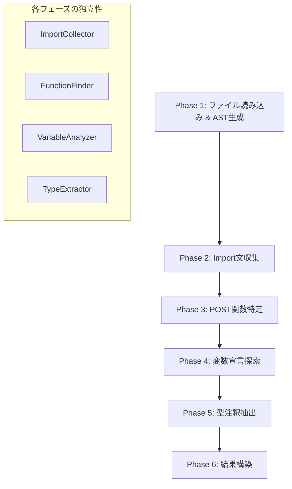

# TypeScript Parser 詳細処理フロー

## 現在の実装分析 (`src/parser/ts-parser.ts`)

### `findBodyType()` 関数の処理フロー

```mermaid
graph TD
    A[ファイル読み込み] --> B[TypeScript AST生成]
    B --> C[単一のvisit関数でノード走査]
    C --> D{ノード種別判定}
    D -->|ImportDeclaration| E[import文を収集]
    D -->|FunctionDeclaration| F{関数名 === 'POST'?}
    D -->|その他| G[子ノードを再帰的に走査]
    E --> H[importMap に格納]
    H --> G
    F -->|Yes| I[POST関数内を探索]
    F -->|No| G
    I --> J[変数宣言を検索]
    J --> K{await req.json() パターン?}
    K -->|Yes| L[型注釈を抽出]
    K -->|No| G
    L --> M[bodyTypeName に格納]
    M --> G
    G --> N{全ノード走査完了?}
    N -->|No| C
    N -->|Yes| O{bodyTypeName && importMap にある?}
    O -->|Yes| P[ParsedTypeInfo を返却]
    O -->|No| Q[undefined を返却]
```

### 現在の問題点

#### 1. **単一責任原則の違反**
```typescript
function visit(node: ts.Node) {
    // Import文の収集 - 責務1
    if(ts.isImportDeclaration(node)) { ... }
    
    // POST関数の探索 - 責務2
    if (ts.isFunctionDeclaration(node) && node.name?.text === 'POST') { ... }
    
    // 再帰処理 - 責務3
    ts.forEachChild(node, visit);
}
```

#### 2. **複雑な入れ子構造**
```typescript
if (ts.isFunctionDeclaration(node) && node.name?.text === 'POST') {
    ts.forEachChild(node.body!, (childNode) => {  // 入れ子1
        if (ts.isVariableStatement(childNode)) {  // 入れ子2
            if (declaration.initializer && ts.isAwaitExpression(declaration.initializer)) {  // 入れ子3
                if (declaration.initializer.expression.getText(sourceFile).endsWith(".json()")) {  // 入れ子4
                    if (declaration.type && ts.isTypeReferenceNode(declaration.type)) {  // 入れ子5
                        // やっと処理
                    }
                }
            }
        }
    });
}
```

#### 3. **文字列マッチングに依存**
- `.endsWith(".json()")` - 脆弱なパターンマッチング
- より複雑な式（`(await req.json())`など）に対応困難

#### 4. **エラーハンドリングの不備**
- AST解析中の例外が適切に処理されていない
- デバッグ情報がない

## 提案する新しい処理フロー

### フェーズ分割アプローチ



### 新しいクラス設計案

```typescript
interface ASTAnalyzer {
    analyze(sourceFile: ts.SourceFile): AnalysisResult;
}

class ImportCollector implements ASTAnalyzer {
    analyze(sourceFile: ts.SourceFile): Map<string, string> {
        // Import文のみを収集
    }
}

class FunctionFinder implements ASTAnalyzer {
    findFunction(sourceFile: ts.SourceFile, functionName: string): ts.FunctionDeclaration | undefined {
        // 特定の関数を探索
    }
}

class VariableAnalyzer {
    findVariableWithPattern(
        functionBody: ts.Block, 
        pattern: VariablePattern
    ): ts.VariableDeclaration | undefined {
        // 特定パターンの変数を探索
    }
}

class TypeExtractor {
    extractTypeAnnotation(variable: ts.VariableDeclaration): string | undefined {
        // 型注釈を抽出
    }
}
```

### パターンマッチング改善案

```typescript
enum VariablePattern {
    AWAIT_REQ_JSON = "await_req_json",
    REQ_JSON = "req_json",
    JSON_PARSE = "json_parse"
}

interface PatternMatcher {
    matches(expression: ts.Expression): boolean;
    priority: number; // より具体的なパターンを優先
}

class AwaitReqJsonMatcher implements PatternMatcher {
    priority = 10;
    matches(expression: ts.Expression): boolean {
        // より厳密なAST構造チェック
        return ts.isAwaitExpression(expression) &&
               ts.isCallExpression(expression.expression) &&
               // ... より詳細な構造チェック
    }
}
```

## 段階的リファクタリング計画

### Step 1: 現在のコードのテスト作成
- 既存の動作を保証するテストケース作成
- 各種エッジケースの確認

### Step 2: フェーズ分割
- Import収集部分を独立した関数に分離
- POST関数探索を独立した関数に分離
- 変数探索を独立した関数に分離

### Step 3: クラスベース設計への移行
- 各フェーズをクラスとして実装
- 依存性注入によるテスタビリティ向上

### Step 4: パターンマッチング改善
- 文字列ベースからAST構造ベースへ移行
- 複数パターンのサポート追加

### Step 5: エラーハンドリング強化
- 詳細なエラーメッセージ
- デバッグモードの追加